

<a style="color: #47975d" href="#abstract">Abstract</a>  
<a style="color: #47975d" href="#what_data?">What data?</a>  
<a style="color: #47975d" href="#filtered_quotes">Filtered quotes</a>  
<a style="color: #47975d" href="#natural_disasters_in_the_world">Natural disasters in the world</a>  
&emsp;&emsp;<a style="color: #47975d" href="#earthquakes_case_study">Earthquakes: case study</a>  
&emsp;&emsp;<a style="color: #47975d" href="#Do_the_quotes_reflect_reality">Do the quotes reflect reality ?</a>  
<a style="color: #47975d" href="#natural_disasters_in_the_us">Natural disasters in the US</a>  
&emsp;&emsp;<a style="color: #47975d" href="#hurricanes_case_study">Hurricanes: case study</a>  
<a style="color: #47975d" href="#analysis_of_speakers">Analysis of speakers</a>  
&emsp;&emsp;<a style="color: #47975d" href="#researcher_vs_politicians">Researcher vs Politicians: How does the way they speak differ ?</a>  
&emsp;&emsp;<a style="color: #47975d" href="#topic_detection">Topic detection</a>  
<a style="color: #47975d" href="#conclusion">Conclusion</a>  

##  Abstract 

Natural disasters, such as earthquakes, hurricanes, floods and wildfires, occur every year causing a lot of damage. Over the years, there has been a growing concern on the extent of climate change and on the potential impact it has on our current environment. The theories on the origin and on the nature of climate change have been flowing, there is still a lot of uncertainty on what to expect with it, but a shifting in the frequency and in the areas impacted by natural disasters has already been observed.

Every year, natural disasters impact the lives of thousands of people across the world, and as the main cause of many disruptions in the world, it is fair to expect the impact of these unfortunate events to spread to the media and the press. This story aims to depict how quotations taken from the news are able to reflect the natural events that have taken place and impacted the real world, and in a reverse manner, how the impact of natural disasters can be observed in the media.  

##  What data?

The QuoteBank dataset consists of millions of quotations found in online articles. Our analyses will be based on using these numerous quotes as an indicator of the overall media coverage of an event, thanks to their large number and to their diversity. It is possible to extract quotes relevant to the subject of natural disasters by selecting the ones citing specific words from a curated dictionary of diverse catastrophes. Along with the help of two datasets containing ground truth information on different kind of natural disasters <a href="https://www.emdat.be/">worldwide</a>, and most specifically <a href="https://www.kaggle.com/headsortails/us-natural-disaster-declarations">in the US</a>, we can try to see what parallels can be drawn between real data about natural disasters and quotes related to them.  

The quotes being in English, most of the quotations are most likely to be driven towards US-related material and events or towards events that have made such an impact that it is worth mentioning in the english or american news. The US natural disaster dataset allows us to have a more precise idea of where specifically in the US the unfortunate events took place, as it encodes county-wise information about the disasters.  

###  Filtered quotes

To specifically target quotes that are relevant to the subject of natural disasters, only the quotes containing words part of a list of words relevant to the subject are kept, such as 'hurricane', 'earthquake', 'fire', and so on. The time distribution of the filtered quotes is shown below :

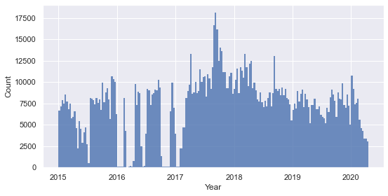 Distribution of the filtered quotes over time

The filtered quotes make up for a total of around 1'500'000 quotes, leaving us with a high number of quotes to work with. The frequency of the quotes is overall uniform despite a few drops, meaning that we can draw consistent comparisons if we compare the frequency of occurence of certain types of quotes in different period of times.

On the other hand, the separate distributions in time of each natural disaster of interest show very irregular and spiky shapes for most of them (figure below). These spikes in frequency mean that there are short periods of time which resulted in a use of the disaster name in the quotes that is far higher than usual. These already suggest that there was increased attention driven towards each natural disaster, already encoding some temporal information about the occurence of each natural disaster in the world or in the United States.

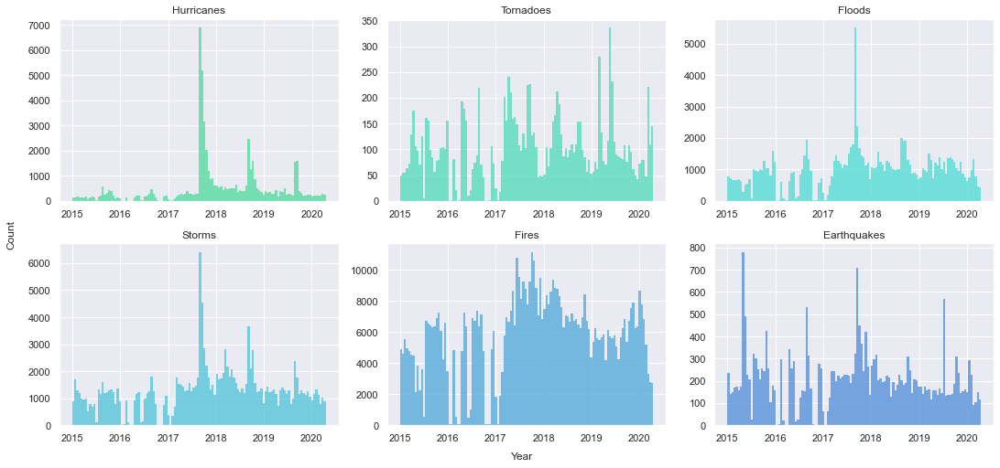 Specific distribution of the quotes over time for each natural disaster type of interest

##  Natural disasters in the world

First getting an insight of how natural disasters affect the world in various ways depending on the area can help us with understanding what quotes to target in order to extract interesting facts from them. Feel free to slide between the different distributions of natural disasters in the world to get a better idea of the pattern with which these unfortunate events strike different areas of the world. The darker the country, the more times it has been struck by an event of the type defined by the slider. Note that data on the natural disasters occuring in countries such as the US are more likely to be reported due to the stronger influence of the american media on an international level as compared to other, smaller countries. This explains why the US are displayed as heavily impacted by most of those disasters and justifies why later focus on the US natural disaster dataset makes sense. 

<iframe src="figures/slider_disasters.html" style="width: 100%; height: 100%; background-color: transparent; border: 0px none transparent; padding: 0px;"></iframe>Distribution of reported natural disasters per type
 

###  Earthquakes: case study

Looking at the earthquake distribution across the globe, we see that there seems to be an area that is particularly prone to experiencing earthquakes. If we zoom in, we see that the whole area including China, Iran and Indonesia has been subject to many earthquakes in recent times. This map encodes information about the frequency distribution of earthquakes but does not display which earthquakes were the largest or the deadliest. We can expect an extraordinary earthquake to have an impact that translates into more quotes being aimed towards them. If we detect the highest peaks (on the figure below), retrieve their dates and location and find the corresponding earthquakes, we get that the earthquakes that triggered the biggest reactions are the following :
<ul>
  <li>Nepal (April 2015)</li>
  <li>Italy (August 2016)</li>
  <li>Mexico (September 2017)</li>
  <li>California (July 2019)</li>
</ul>
 

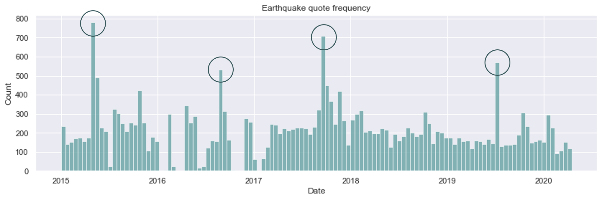Frequency of quotes related to earthquakes with highlighted highest peaks

This standing is solely based on their impact on the quotations and not on whether they actually had a dramatic impact or not. As depicted on the world map above, Iran is a country that is being recurrently struck by earthquakes. If we plot the distribution of quotes that are at both relevant to earthquakes and Iran (available from 2015 to 2020 only, as opposed to the natural disaster dataset), we see that there's a notable peak in 2017, corresponding to a major earthquake that occured close to Iraq in <a href="https://reliefweb.int/disaster/eq-2017-000165-irn">Iran</a>, injuring around 10'000 people. <figure style="text-align: center; display: inline-block; float: right; margin: 0px 0px 12px 15px; max-width: 55%">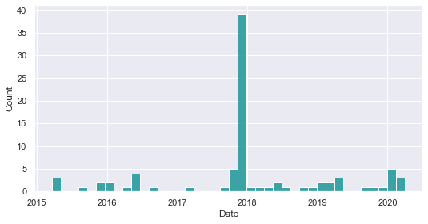<figcaption>Frequency of quotes related to earthquakes in Iran</figcaption></figure>
It does not make sense to compare those numbers with the ones from Nepal (significantly deadlier) and the ones from Mexico or California as it is part or related to the US, therefore more covered in the news. However, if we compare those to the earthquake that occured in <a href="https://en.wikipedia.org/wiki/August_2016_Central_Italy_earthquake">Italy</a> in 2016, the impact of the latter is significantly lower, with 400 people injured in the process.

If we now compare the impact the two events had in the news, using a plot of the quotes frequency at the moment of the event and for a duration of 11 days (until it stops being reported), we see that surprisingly the amount of quotes related to the italian disaster are significantly higher, as hinted by the peak previously detected in the earthquake distribution. Interestingly, these quotes suggest that the media coverage of the Iranian disaster is lower and fades faster, despite the event causing a lot more damage. Considering the long-lasting tense relationship between the US and Iran, we could expect that for two events that have no apparent link with the US, the one occuring in Iran is less likely to be reported by the news, as US news make up for a significant part of the quote dataset.

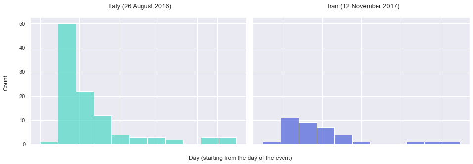Comparison between the occurence of quotes related to each event, each bin represents a day

###  Do the quotes reflect reality ?

Are there Natural Disasters that are more spoken about compared to how often they occur ? If so, why is that ? To answer that question, we first want to see how the distribution of each type of natural disaster reported by the quotes compares to the actual distribution of the natural disasters that happened between 2015 and 2020.

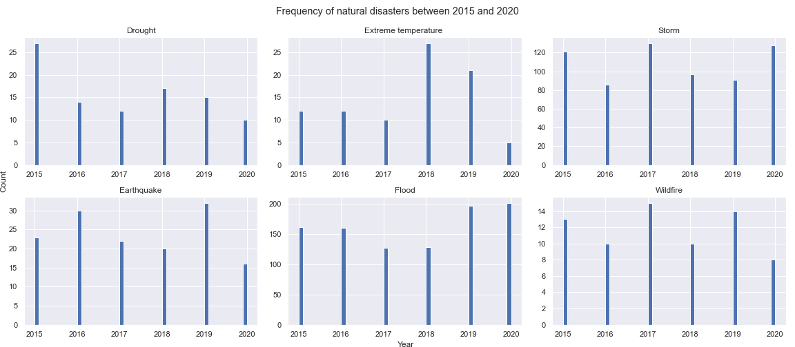 Specific distribution over time for each natural disaster type of interest

Seeing there is a disparity between the distribution of the quotes and the distribution of the natural disasters reported by the CRE , we compare the ratios of the number of quotes relating to each type of natural disaster to the number of actual occurences of said natural disaster each year from 2015 to 2020. 

 

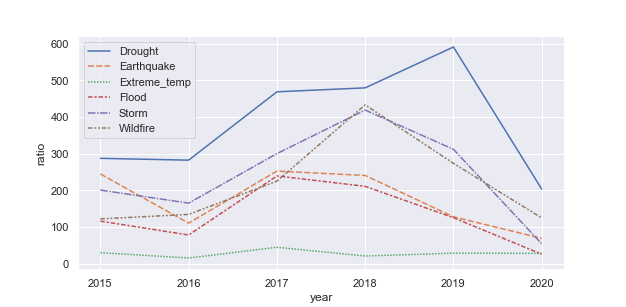 Ratio of the number of quotes to the number of occurences

We can see that, between 2015 and 2020, Drought has been the Natural Disaster that is most talked about every year compared to how often it occurs. While it only happened 95 times in that timespan, it was mentionned in almost 37k quotes. On the other hand, Flood and especially Extreme temperature are less represented by the quotes and are not very much talked about. This contrast can be explained by the fact that people perceive Drought as the a more threatning and intense issue and while not occuring frequently, it impacts more people. As for the under representation of Flood for example, one explanation would be that due to the fact that this natural disaster happens quite frequently (973 times in 5 years) , people are much more used to it and desensitized and therefore less likely to talk about it. We could also argue that every type of natural disaster is particular to certain regions of the globe and therefore its represenation in the quotes will depend on the media coverage that said region gets,as we have explored in the previous section.  

    

##  Natural disasters in the US

Moving the focus onto the US, we can exploit the dataset specific to the United States to have a better understanding of the pattern of natural disasters across the country. Use the interactive map below to slide between the disaster types and see their reported location county-wise. Note that state-wise disasters increase the count for all the counties of their state.

<iframe src="figures/slider_us.html" style="width: 100%; height: 100%; text-align: center; background-color: transparent; border: 0px none transparent; padding: 0px;"></iframe>Repartition of the natural disasters per type across the US
 

From the different scales used here for each disaster type, we deduce that the US are heavily impacted by floods, fires and hurricanes. The other classes still give interesting input on the meteorological dynamics of the country

###  Hurricanes: case study

It is well known that hurricanes have been constantly causing troubles in the United States. The interactive map above already suggests that some areas of the country are more subject to being disrupted by hurricanes, let's have a look at the quotes to see what interesting findings we can find in them. The location of disasters can also be partly inferred from the quotes either by looking for names of states or cities in the quotes, or by comparing the dates of the peaks in frequency with the ground truth dataset of natural disasters and extracting the location. Here is an example of all the quotes that contain a state name.

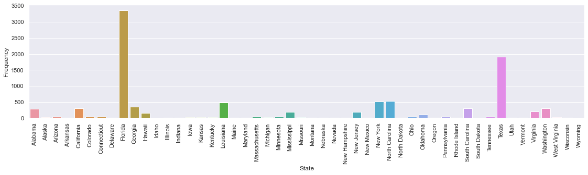Count of quotes containing each state name

From the above figure, we see that Florida comes out on top by a mile, then comes Texas, and finally Carolina (North and South) as well as New York remain heavily linked to hurricanes according to the quotes. A deeper look at the time-series of the quotes containing 'Florida' and its capital city, 'Tallahassee', leads us to the plot below :

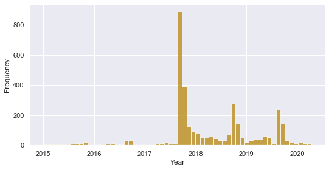 Frequency of quotes containing 'Florida' or 'Tallahassee'

If we compare the shape and the time distribution of the main peaks, we see that it looks fairly similar to the distribution of all the quotes containing 'hurricane' (see figure in <a href="#filtered_quotes">Filtered quotes</a>). This means that the events occurring in Florida make up for most of the concern driven towards hurricanes in the news. When retrieving its date, the main peak occurring in 2017 is actually the same one as the highest peak in the overall distribution of the quotes also displayed in <a href="#filtered_quotes">this section</a>. When looking at the quotes, this peak in frequency was caused by <a href="https://en.wikipedia.org/wiki/Hurricane_Irma">Hurricane Irma</a>, which caused major damage in the US in September 2017, in particular in Florida, Georgia and North Carolina.  
In addition to that, we notice a pattern of recurrence in the quotes related to Florida and hurricanes towards the end of every year. This is due to an interesting phenomenon seasonality that causes the hurricanes to be more likely to occur at the same time every year. It comes under the name of <a href="https://www.nhc.noaa.gov/climo/">Hurricane Season</a> and is due to the transfer of heat originating from tropical waters to colder waters, explaining the higher rate of hurricanes around Florida as the waters start to cool down around September every year, causing hurricanes to move to these areas.  
We can now try to use the data from the quotes to build a state-wise spatial distribution of the occurence of hurricanes in the US. The ground truth map is also displayed below as a mean of comparison. We see that the overall distribution is similar, meaning that the quotes seem to reflect factual data about natural disasters. The reconstructed map is not as precise as the ground truth map and can not be, as a county-wise precision can not be achieved solely based on quotations. Indeed, some county names such as Washington are used 31 times only in the US, making it impossible to infer spatial information from such quotes with certainty.  

  

<iframe src="figures/quote_us_map.html" style="width: 100%; height: 100%; text-align: center; background-color: transparent; border: 0px none transparent; padding: 0px;"></iframe>Reconstructed map of the occurrence of hurricanes in the US
 

<iframe src="figures/us_hurr_map_no_quote.html" style="width: 100%; height: 100%; text-align: center; background-color: transparent; border: 0px none transparent; padding: 0px;"></iframe>Ground truth map of the occurrence of hurricanes in the US
 

<!---

Map Test 18

<iframe width="1250px" height="860px" src="figures/lda_res_pol.html" style="-webkit-transform:scale(0.65);-moz-transform-scale(0.65); position: absolute; top: -9999px; bottom: -9999px; left: -9999px; right: -9999px; margin: auto;"></iframe>

  

  <iframe src="figures/lda_res_pol.html" allowfullscreen></iframe>

  
  

  NEW TEST 6

    <iframe src="figures/lda_res_pol.html"></iframe>

<iframe style="width: 100%; height: 100%; -webkit-transform: scale(0.7); -moz-transform: scale(0.7);" src="figures/lda_res_pol.html" ></iframe>Topic detection of quotes where the speaker is a politician or a researcher

-->
<!---

<iframe style="width: 100%; height: 100%; -webkit-transform: scale(0.6); -moz-transform: scale(0.6); -webkit-transform-origin: top left;" src="figures/lda_res_pol.html" ></iframe>Topic detection of quotes where the speaker is a politician or a researcher

-->

<!--- Useless ?
#### Exploration

With a quick look at the frequency of natural disasters key words in the quotations, one can observe peaks that most likely indicate the crisis.  

  
   

These can be easily verified with the ground truth dataset.  
Note that with some inspection, one can notice that some quotes contain natural disaster key words, but in other contexts like comparisons or hyperboles (E.g. Fire, storm, earthquake, ...). Here is another example for Wildfires cases.  

  

-->

##  Analysis of speakers

Now, let us investigate the speakers. What are their professions? For the politicians, what are their political affiliations? In the following graph we have plotted the distribution of the ten most common professions among the speakers in our list. Since we suspected that politicians may speak much more often than other groups we also plotted the distribution of quotes per profession.

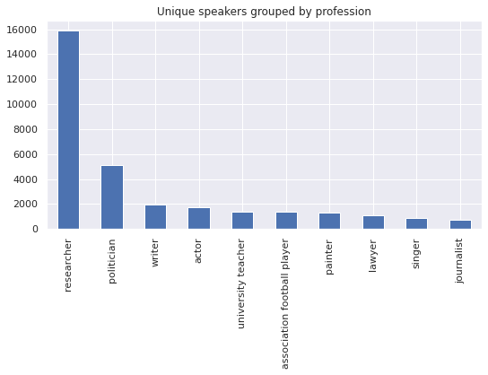
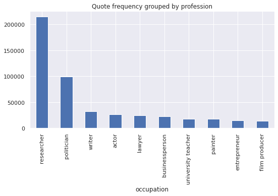

We see that among the top ten groups, politicians speak slightly more often, but this increase is small enough that we can pretend that every unique speaker gives approximately the same number of quotes.
We see that the most frequent speakers are researchers followed by politicians. The rest of the occupations trail behind, having roughly the same frequency each.

<!-- TODO Maybe remove this bit -->

In the following graph we have plotted the distribution of the ten most common political affiliations among our speakers.

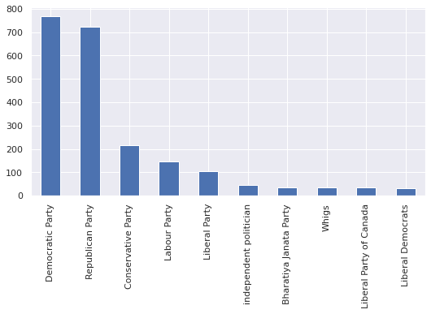

The parties that appear most often are those that operate in english-speaking countries. This is unsurprising given that we work with english quotes.

Later in the article, we will perform a bag-of-words logistic regression to
differentiate researcher quotes with politician quotes. Having found a good
fit, in the section after it we will display the result of a latent Dirichlet
analysis (LDA), in the hopes of detecting what are the two main topics each
group is talking about.

###  Researcher vs Politicians: How does the way they speak differ ?
We decide to turn our attention to the vocabulary used by politicians and researchers. How do they approach tragic events such as natural disasters?
We have created a model that is capable of identifying whether a certain quote is being spoken by a politician or a researcher with a high degree of certainty (greater than 99.5%). We found that the ten most representative words for the two groups were the following.

| Researchers | Politicians    |
| -           | -              |
| drought     | president      |
| season      | louisiana      |
| community   | state          |
| between     | terrorist      |
| fires       | attack         |
| chemicals   | terrorists     |
| there       | world          |
| biological  | nuclear        |
| still       | families       |
| risk        | federal        |
{: .tablelines}

We can see that politicians are much more likely to talk about terrorism or to refer to other places or to other people.

###  Topic Detection
Having found a good fit for the logistic model we decided to perform Latent Dirichlet Analysis (LDA) on the joined set of quotes.
When clustering for two topics we see that one of the clusters is composed of aggressive words, or of words that refer to other people or places.
By the analyses done in the previous section, we suspect that this aggressive cluster is closely tied to the quotes spoken by politicians.

<a href="figures/lda_res_pol.html">*See the LDA on a standalone page*</a>

<iframe src="figures/lda_res_pol.html" style="width: 100%; height: 100%; object-fit: contain; text-align: center; background-color: transparent; border: 0px none transparent; padding: 0px; margin-left: 0px" frameborder='0' ></iframe>Topic detection of quotes where the speaker is a politician or a researcher
 

The other cluster seems to talk about things that are generally related to natural disaster. Let's see if we can break it up into sub-topics by increasing the number of clusters. <a href="figures/lda_res_pol_6.html">On this page</a> we can see the result of breaking up the quotes into more clusters. We see that even then, the topics remain together, indicating that separating in two was most likely a good choice.

Finally, on <a href="figures/lda_res_pol_30.html">this page</a> we can see the result of breaking up the quotes into 30 topics. A few things to note are

* Australia and bushfires get their own separate topic. Probably relating to the devastating forest fires of early 2020.
* There is a topic relating Donald Trump and hurricanes.
* The general topic about natural disasters remains mostly whole, although a few sub-topics related to particular places do split off.
* There is a large topic dedicated to the discussion of Qasem Soleimani.

##  Final words

The goal was to work with quotes from the QuoteBank database, in this case we were interested in observing what the quotations told us about natural disasters ocurrences in the world. We were able to pinpoint temporally and geographically various types of catastrophes from the quotes and verify the outcomes through ground truth dataset. The next step was to look more in depth at the speakers. We observed the main topics represented in their speeches and also their occupations and political affiliation. We concluded that it was indeed easily possible to differentiate between politician and researcher, as they have distinct vocabularies. 
To conclude, there were many ways to exploit the given dataset, as it was very rich and complete. A lot of other analyses, based on machine learning for instance, would be possible with the subject of natural disasters, but might have required more data.

